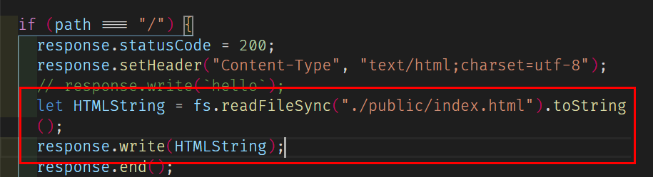
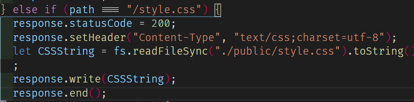
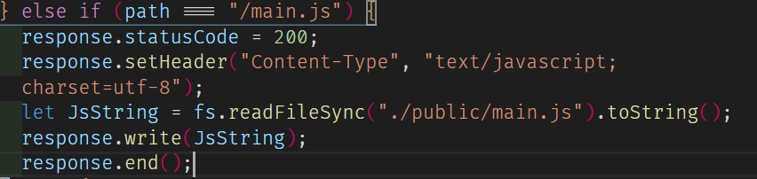

## AJAX 入门

### 前提

- HTTP 的原理 请求和响应
- 安装了`nodeJS`

### 概要

- 就是用 JS 发请求和收响应

### 背景

- 以前用 JS 发不了请求和接响应 后来浏览器提供了`XMLHttpRequest`的全局构造函数 让其变为可能 貌似最开始是 IE5
  - 最早就是 URL 栏
  - 表单
  - 可以发请求
- 然后 google 用这门技术写了 GMail 震惊世界 他的用法被后人称为 AJAX

### 准备一个服务器

- [服务器内容](./server.js)
- `node server.js 8888`
  - 这次用 `node-dev` 来玩 因为不自动更新开发效率会低
  - `yarn global add node-dev`

### 不用 AJAX

1. 加载 HTML
   1. 搞定
   2. 
2. 加载 CSS
   1. 
3. 加载 JS
   1. 

### 用 AJAX

1. 加载 CSS
   1. 搞定
   2. 写了三个版本
   3. DEMO 用的简写
   4. onerror 废弃
   5. 使用`readyState`以及`status`
2. 加载 JS => done
3. 加载 HTML => done
4. 加载 XML => done
5. 加载 JSON => done

### 四个步骤

1. 创建请求对象 new
2. `.open()` //注意别把第三个参数设 false 这样很白痴
3. 监听成功失败 `onload` `onerror` //oh 是垃圾
   1. 用 `onreadystatechange`
4. 发送请求 `.send()`
5. 返回的东西 需要渲染
   1. > css createEle style innerHTML 赋予 把 style 插 head
   2. > js script 插 body 别的一样
   3. > HTML 一样
   4. > XML 噗 响应里面可以直接拿到 XML 的 DOM 对象形态 www responseXML
   5. > JSON parse 转换类型 不是都对象哟 6 种类型都可以！！！记得用 try catch 因为不符合 JSON 语法的会抛错误
      1. 反过来也记得用 try catch 哟

# 总结一下先

- HTTP 是一个框 什么都能装
- 记得设置正确的 contentType

# 继续随便写

- contentType 有两种可以写 application 或者 text JSON

# 加载分页

- AJAX 的经典案例
- page1 的操作好骚呀 HTML 先占位 用{{}}
- 服务器上直接 replace 换成数据
- 然后拿到的数据 转换成数组 map 加工到标签 然后替换 ww 列表就出来了
- 好古老好有趣

# 到时候去看看

- IWServer.js
- IWAjax,js
