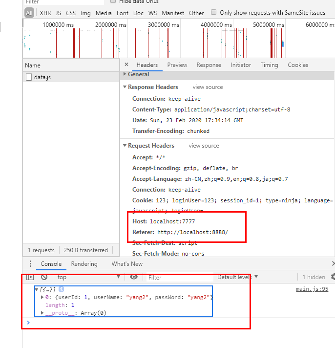
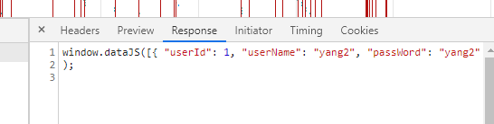
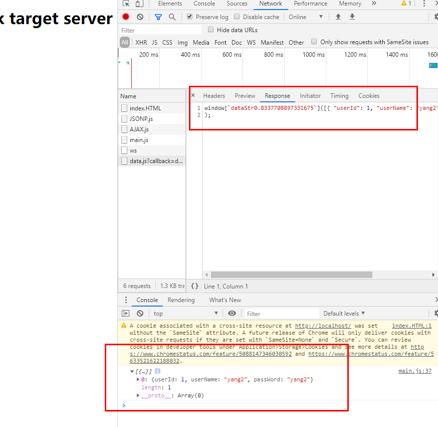

1. 同源策略
   1. 源
      1. `window.origin`
      2. `location.origin`
      3. 协议 域名 端口号
   2. 完全一致的话 就是同源
   3. 同源策略就是说 JS 不能在不同源的地方拿数据
   4. 这是浏览器的功能 为了保护用户隐私 防止偷数据
      1. 因为正常的请求和不正常的请求的唯一区别是 `refer` 就是源
      2. 后台可以处理 通过检查`refer`
      3. 为了以防万一 所以直接杀掉这个可能性了
      4. 俗称 `安全原则`
   5. 验证自己去建 2 个 server 玩玩就知道了
      1. 想的话自己去改个 host 玩 如下图
      2. 
   6. 注意 引用 CSS JS 什么的可以哟
      1. 你用 AJAX 去拿那些试试看呀 笑
      2. 但其实蛮难懂的 为啥引用使用可以？！笑
2. CORS
   1. 但是 如果俺声明的话就可以突破同源策略啦
   2. 具体就是在有数据的响应头里面写允许的源
   3. access control allow origin 允许对象
   4. 哎呀 自己看 mdn 去
   5. 搞定 话说别的也有拒绝的情况 刚刚碰到很多个哎
   6. 
3. JSONP
   1. 啊哈 IE 6789 不支持 不知道 11 支不支持
   2. 就是在 JS 里面写数据 全局变量搞一个就好了
   3. window.xx={} 就好
   4. 噗 突然发现这个方法就是我们家的嘛 www 笑
   5. 正常一点的话就是用回调咯 笑
   6. 搞定 w
   7. 
   8. 
   9. 然后问题来了 谁知道了不就可以偷数据了吗 ww
   10. 检查`refer`
   11. 但是其实信任的`refer`被黑了 还是蛋疼。。
   12. 噗 random 那段好骚 script.src ?传参 后端 qurey 接到 再占位 replace
   13. script 拿完数据 remove 这里也很骚呀
   14. 封装 jsonp
   15. 约定俗成 叫 callback 不叫 functionName 哟
   16. 缺点 因为是 script 标签 所以只有 GET 方法 当然木有 POST 啦
   17. 而且当然木有状态嘛呀报头啥的。。
   18. 
   19. 完美
