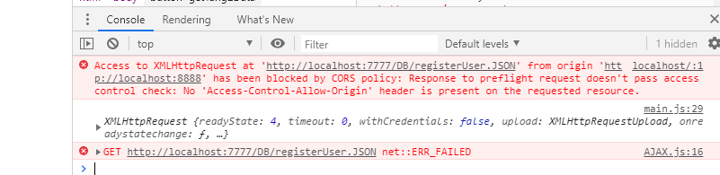
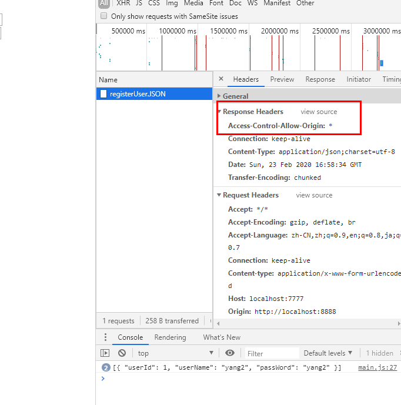

1. 关于同源
   1. 源
      1. `window.origin`或`location.origin`可以看当前源
      2. 就是`协议` + `域名` + `端口号`
   2. 源一摸一样的话 就是同源
2. 同源策略
   1. 他是浏览器的一个功能限制
   2. `运行在`源 A 的 JS 不能从源 B 拿`数据` 俗称`不允许跨域`
   3. 主要是为了保护用户隐私 防止被偷数据
      1. 因为正常的请求和不正常的请求除了 `Referer` 就没啥区别
      2. 后台可以处理 通过检查`Referer`
      3. 为了以防万一 所以直接杀掉这个可能性了
      4. 俗称 `安全原则` //安全原则就是不怕一万只怕万一
   4. 验证 => 自己去建 2 个 server 玩玩就知道了
      1. 
   5. 注意 `引用` 是可以的
      1. 具体看[代码](./hacker/public/main.js)
      2. `<link rel="stylesheet" href="http://localhost:9999/style.css">`是可以的 好吧 这是废话 ww
3. `CORS` => 突破同源策略限制的一个办法
   1. 实现方法就是在服务器端写`俺们允许他来俺们服务器来拿数据`的一个声明
   2. 具体就是在响应头里面写允许的源
   3. `response.setHeader("Access-Control-Allow-Origin", "http://localhost:8888");`
   4. 别的写法自己看 mdn 去
   5. 
4. `JSONP` => 突破同源策略限制的另一个办法 主要是为了 IE
   1. 据说 IE 不支持`CORS`
   2. 好吧 IE11 支持的 也就是说俺司不需要这个..
5. 嘛 实现方法还是写一下
   1. 通过可以`跨域引用`这个特点实现的
   2. 我们先弄个函数`window[callback] = data => {};`
   3. 再新建个`script`
   4. 在`script.src`里通过`?callback=${callback}`
   5. 把跟服务器端的小哥哥沟通好的`让他去调用的函数的名字`传到服务器端 //好吧俗称 callback
   6. 引用/插入`script`
   7. 服务器端收到请求后返回一个`window[callBack](data);` //这个 data 是我们要的数据
   8. 然后我们通过早就准备好的`window[callback] = data => {};` 接到要的数据
   9. [俺封装的 JSONP](./hacker/public/JSONP.js)
   10. 需要服务器端做的事情
       1. `window[`{{callBack}}`]({{data}});`
       2. 用`parsedUrl.query.callback`拿到俺传过去的`callback`然后替换`{{callback}}`
       3. 用正确的`data`替换`{{data}}`
       4. 然后通过响应返还给俺
   11. 小细节
       1. 服务器端还是必须写`Referer`来防盗数据
       2. 但是即使如此 如果俺的网站被黑的话还是防不住 `callback`用随机数会更好
       3. 因为是`script`标签实现的所以只有`GET`而且木有`状态码`之类的
       4. 用`JSONP`的时候，拿到数据了就把`script`删除
